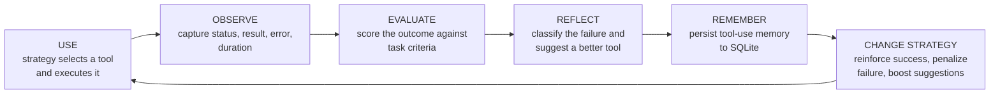
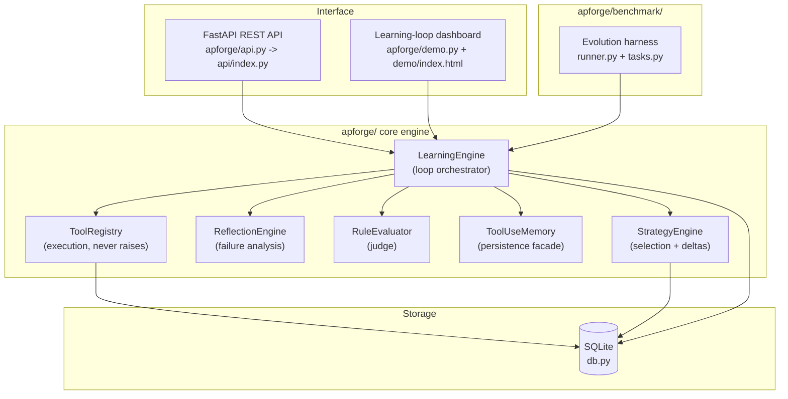

<div align="center">

# APforge

**The agent that learns to use its tools.**

An automated engineering loop that turns every tool use into experience — a self-improving agent whose strategy for choosing tools gets measurably better with every task it runs.

**Syndicate by Maximor — Track 1: Automated Agent Engineering**

[](https://apforge-wine.vercel.app/)
[](https://www.python.org/)
[](https://fastapi.tiangolo.com/)
[](https://www.sqlite.org/)
[](https://github.com/anshulchikhale30-p/APforge)
[](LICENSE)

**Built for the judges** — the [official criteria](#for-the-judges-how-this-repo-hits-the-criteria) are at the bottom, and every number in this README comes from real executions of the committed code (`benchmarks/results/`). Nothing here is fabricated.

</div>

---

## The 30-second pitch

> Most agents are static: same prompts, same tools, same mistakes — forever.
>
> **APforge closes the loop.** Every task produces a trace, an evaluation, and a reflection. The agent *remembers* what worked and *changes its strategy* for the next task. Then it is measured again — on tasks it has **never seen**. On a deterministic 4-suite benchmark, a naive agent that solves **0 of 20** held-out investigations learns to solve **all 20** — and all **24 unseen** investigations — in about 40 learning turns per suite (12 + 28), while cutting:
>
> - wasted tool calls **-100%** (216 -> 0 and 264 -> 0)
> - tool failures **-100%** (102 -> 0 and 126 -> 0)
> - measured latency **~-85%**
> - modeled cost **-78%**

**Verify it yourself in 30 seconds:**

| Step | How |
|---|---|
| **Watch it live** | Open the demo — a real learning loop runs in your browser: [`https://apforge-wine.vercel.app/`](https://apforge-wine.vercel.app/) → click **Replay Learning Loop** |
| **Read the raw evidence** | `benchmarks/results/evolution_summary.md` + `results.json` (per-call traces) |
| **Re-run it** | `python benchmarks/run_evolution.py` — deterministic, fixed seeds, regenerates the results |
| **Check the integrity** | `python -m pytest` — 96 tests, including "no answer-key leakage" tests |

---

## How APforge learns

The engine implements one core loop, and each phase is a real, testable step:

**USE -> OBSERVE -> EVALUATE -> REFLECT -> REMEMBER -> CHANGE STRATEGY -> USE AGAIN**



| Phase | What actually happens (in code) |
|---|---|
| **USE** | `StrategyEngine.select_tool` scores every candidate as `prior + learned_delta + empirical_memory`, then `ToolRegistry.execute` runs it. Tool execution never raises — failures become structured results the loop can learn from. |
| **OBSERVE** | The outcome is captured as an `Observation`: status, result, error, wall-clock duration. |
| **EVALUATE** | `RuleEvaluator` scores the observation in `[0, 1]` against task criteria (correct datum, outcome signals, duration caps, forbidden content) and emits outcome-level feedback — it never echoes an answer key. |
| **REFLECT** | `ReflectionEngine` classifies the failure (`tool_unavailable`, `parameter_error`, `environment_error`, `logic_error`), writes an analysis + lesson, and proposes the best alternative tool. |
| **REMEMBER** | `ToolUseMemory` accumulates success/failure counts per `(agent, task_type, tool)` in SQLite — durable across restarts. |
| **CHANGE STRATEGY** | `StrategyEngine.update` applies deltas: reward `+0.4` on strong success, penalty `-1.0` on failure, boost `+0.6` on a suggested tool (clamped to `[-5, 5]`). Any material change bumps the agent version with an immutable snapshot. |
| **USE AGAIN** | The next selection already reflects everything learned — verified by measuring V2 and V3. |

---

## The benchmark: V1 -> V2 -> V3

Four realistic engineering-investigation suites. Each suite has 21 deterministic instances: 3 `train_a` (experience 1), 7 `train_b` (experience 2), 5 `eval` (held-out scoring), and 6 `gen` (**unseen** generalization). Instances are generated from fixed seeds — the experiment is fully reproducible.

| Suite | The investigation the agent must close |
|---|---|
| `ci.build` | Flaky CI build: dependency resolution, flaky test, runner health, config drift |
| `sre.outage` | Production outage triage: degraded service, overloaded region, config drift, recent deploys |
| `debug.segfault` | Native crash debugging: stack trace, memory profile, binary version, core dumps |
| `perf.regression` | Latency regression hunt: p95, connections, lock contention, queue depth |

Each suite registers 9 instruments (4 correct, 4 decoys, 1 degraded). 36 instruments across the benchmark. A naive V1 agent is biased toward the tempting-but-wrong decoy of every step; two learning phases then reshape its strategy.

### Held-out eval instances (20 scenarios — never part of training)

| Metric | V1 (naive) | V2 (after learning A) | V3 (after learning B) |
|---|---:|---:|---:|
| Scenario solve rate | 0.0% | 40.0% | **100.0%** |
| Step success rate | 0.0% | 83.3% | **100.0%** |
| Total tool calls | 216 | 96 | 72 |
| **Unnecessary tool calls** | 216 | 36 | **0** |
| Failures (errored calls) | 102 | 0 | **0** |
| Total measured latency | 2943 ms | 582 ms | 454 ms |
| Avg latency per call | 13.62 ms | 6.06 ms | 6.31 ms |
| Modeled cost (units) | 327.30 | 96.00 | 72.00 |
| Modeled cost / solved scenario | — | 12.00 | 3.60 |

### Unseen gen instances (24 scenarios — never executed during training)

| Metric | V1 (naive) | V2 (after learning A) | V3 (after learning B) |
|---|---:|---:|---:|
| Scenario solve rate | 0.0% | 33.3% | **100.0%** |
| Step success rate | 0.0% | 81.8% | **100.0%** |
| Total tool calls | 264 | 120 | 88 |
| **Unnecessary tool calls** | 264 | 48 | **0** |
| Failures (errored calls) | 126 | 0 | **0** |
| Total measured latency | 3612 ms | 731 ms | 554 ms |
| Avg latency per call | 13.68 ms | 6.09 ms | 6.30 ms |
| Modeled cost (units) | 400.80 | 120.00 | 88.00 |
| Modeled cost / solved scenario | — | 15.00 | 3.67 |

> Measured on **unseen** instances — bundles the agent never executed during training. If the learned strategies did not transfer, the later stages could not solve novel instances without retraining.

### Improvement summary (V3 vs V1)

| Metric | Held-out eval | Unseen gen |
|---|---:|---:|
| Unnecessary tool calls | **-100%** (216 -> 0) | **-100%** (264 -> 0) |
| Total tool calls | -66.7% (216 -> 72) | -66.7% (264 -> 88) |
| Failures | **-100%** (102 -> 0) | **-100%** (126 -> 0) |
| Measured latency | -84.6% (2943 -> 454 ms) | -84.7% (3612 -> 554 ms) |
| Modeled cost | -78.0% (327.3 -> 72.0) | -78.0% (400.8 -> 88.0) |

### Generalization per suite (unseen scenarios)

| Suite | V1 | V2 | V3 |
|---|---:|---:|---:|
| `ci.build` | 0.0% | 33.3% | **100.0%** |
| `sre.outage` | 0.0% | 33.3% | **100.0%** |
| `debug.segfault` | 0.0% | 33.3% | **100.0%** |
| `perf.regression` | 0.0% | 33.3% | **100.0%** |

### What the learning phases actually did (per suite)

| Phase | Full-loop turns | Successes | Failures | Strategy updates | Engine version |
|---|---:|---:|---:|---:|---:|
| A (first experience) | 12 | 3 | 9 | 21 | 1 -> 13 |
| B (more experience) | 28 | 27 | 1 | 29 | 13 -> 41 |

V1 stays at engine version 1 with naive decoy priors; each learning phase that changes the strategy bumps the version and stores an immutable snapshot of the strategy set plus the reason.

*Results generated `2026-09-06T04:09:44Z` by `benchmarks/run_evolution.py`. Source of truth: `benchmarks/results/evolution_summary.json` and `results.json`.*

---

## What this proves — and what it does not

APforge's results are intentionally honest about their scope:

| Claim | Status |
|---|---|
| A deterministic learning loop measurably improves tool selection on this benchmark | **Proven** — reproducible, fixed-seed, real harness executions |
| The improvement transfers to unseen instances of the same task types | **Proven** on the benchmark's `gen` split (24 / 24 scenarios) |
| The agent solves *every* real-world task | **Not claimed** — the benchmark is deterministic and self-contained |
| Benchmark latency = production latency | **Not claimed** — latency is wall-clock ms measured around real tool calls, but the tools model heavyweight instrumentation using small **deterministic simulated delays** |
| Modeled cost = actual API billing | **Not claimed** — cost is a **modeled per-instrument charge** (units per call) applied to real recorded call counts; the engine makes no paid API calls |
| The engine is production-ready for live agent fleets | **Not claimed** — see [Limitations](#limitations) and [Roadmap](#roadmap) |

The 100% solve rates are real **measured results on this deterministic benchmark** (20 held-out + 24 unseen scenarios) — not a claim of universal accuracy.

---

## Evaluation integrity: judge-hardening

The most dangerous failure mode for a self-improving agent is **cheating its own judge**. If the feedback the agent learns from leaks the identity of the correct tool — or the answer key — the "learning" is fake. APforge was explicitly hardened against this:

- **Criteria carry outcomes, never answers.** `build_criteria()` returns only `expected_field` + `expected_output` (the ground-truth *datum*) and the outcome signals `wrong-information-source` / `insufficient-evidence`. The correct tool's *name* is never part of the feedback the agent sees.
- **Field-based comparison.** `RuleEvaluator` compares only the expected sub-field of the result and emits signal notes — it does not echo the datum or any tool name into persisted evaluations.
- **Judge-side scoring.** The runner keeps `step.correct_tool` judge-side; measurement marks a step solved only when the correct instrument was used *and* its output matched the ground truth.
- **Locked in with tests.** "No-leak" tests assert that `build_criteria` contains no tool name for every suite/step/instance, that persisted training feedback for all `ci.build` turns contains no correct tool, and that demo loop payloads carry no answer-key keys.

This hardening pass is visible in git history: `3951e3c` *"fix: stop leaking correct-tool identity in judge feedback"*, followed by `f7f2afb` which **regenerated the committed benchmark results** so every number in this README reflects the hardened evaluator.

---

## Persistent memory, strategy updates, and agent versioning

Everything an agent learns is durable and inspectable — no state is lost on restart.

**SQLite storage layer** (`apforge/db.py`, WAL mode, thread-safe, foreign keys on):

| Table | Stores |
|---|---|
| `agents` | Agent identity + current version |
| `agent_versions` | **Immutable snapshots** of the strategy set at every version, with the reason for each bump |
| `execution_traces` | Every tool use: tool, arguments, status, result, error, timestamps, duration |
| `evaluations` | Score, criteria, outcome-level notes per trace |
| `reflections` | Failure category, analysis, lesson, suggested tool per trace |
| `tool_memory` | Success/failure counts + success rate per `(agent, task_type, tool)` |
| `strategies` | Learned preferences: `prior` (baseline) + `delta` (accumulated reinforcement) + reason |

**Agent versioning** is automatic: any material strategy change bumps the version (`db.bump_agent_version`) and records an immutable snapshot plus a human-readable reason — so you can exactly reproduce what "version 41" knew, and why. The benchmark measures stages at engine versions **1 -> 13 -> 41**.

**Failure analysis** is structured, not anecdotal: every failure is classified (`tool_unavailable`, `parameter_error`, `environment_error`, `logic_error`), turned into a lesson, and paired with a concrete tool suggestion that the strategy engine can reinforce.

---

## Technical architecture



| Module | Responsibility |
|---|---|
| `apforge/engine.py` | `LearningEngine`: runs the full loop — `turn()` and `run_session()` compose the phases end to end; each phase is also a public, independently testable method |
| `apforge/strategy.py` | Tool selection scoring (`prior + delta + empirical memory`) and reinforcement updates with clamping |
| `apforge/reflection.py` | Failure classification + lesson + alternative-tool suggestion |
| `apforge/evaluation.py` | Deterministic rule-based judge with judge-hardened outcome-level feedback |
| `apforge/memory.py` | Accumulates `(agent, task_type, tool)` success/failure statistics in SQLite |
| `apforge/tools.py` | Ordered `ToolRegistry`; `safe_evaluate` (AST-based, no `eval`); built-in tools incl. a deterministic flaky API tool |
| `apforge/db.py` | Thread-safe SQLite layer: full schema, indexes, WAL, version snapshots |
| `apforge/api.py` | FastAPI REST API: agents, turns, sessions, traces, evaluations, reflections, memory, strategies, versions |
| `apforge/demo.py` | Demo app: serves the dashboard + real data + serverless-safe live loop replay |
| `apforge/benchmark/` | `tasks.py` (4 suite definitions, deterministic bundles) + `runner.py` (evolution harness, metrics, report generation) |

---

## Built with Agent Orchestration (AO)

APforge was built as a sequence of small, independently verifiable slices, each merged only after review — an orchestrated, review-gated build process.

**The slice history (from the git log):**

1. `df45230` — scaffold the learning engine (models + SQLite storage)
2. `ac50591` — add the full learning-loop engine (tools, traces, evaluation, reflection, memory, strategies)
3. `262f547` — expose the loop over HTTP (FastAPI)
4. `30bb49a` — tighten type hints
5. `9e99ef0` — add the evaluation & benchmarking layer (V1 -> V2 -> V3 evolution)
6. `052039d` — add the lightweight learning-loop demo dashboard
7. `3951e3c` — **judge-hardening fix** (stop leaking correct-tool identity) + leak tests
8. `f7f2afb` — regenerate benchmark results under the hardened judge
9. `6385589` / `9a55494` — make the demo replay serverless-safe
10. `4ccc12b` — add Vercel deployment configuration

**How the workflow looked:**

- **Review-gated merges.** Changes landed through pull requests targeting `main` (see PRs #1 and #2 in the repo history), not direct pushes.
- **Feature branches per slice** (`core-learning`, `evaluation`, `demo`, `judge-hardening`) plus recurring worker session branches under the `ao/` namespace — an explicit orchestrator-driven worker workflow where each unit of work was scoped, implemented, and verified separately.
- **Feedback-driven hardening.** Reviewing the persisted evaluation/reflection output revealed that correct-tool identity leaked into feedback — a real integrity bug found *by* inspecting the artifacts. It was fixed with regression tests, then the benchmarks were regenerated so committed numbers match the fixed code.
- **Test-gated at every step.** The suite grew with each feature and stayed green (96 tests) before every merge.

---

## The demo & How to use it

The live demo at [`https://apforge-wine.vercel.app/`](https://apforge-wine.vercel.app/) is a real dashboard, not a mockup:

- **A live learning loop, turn by turn** — a fresh session on the real `ci.build` engine runs USE -> OBSERVE -> EVALUATE -> REFLECT -> REMEMBER -> CHANGE STRATEGY in your browser. Each turn shows the tool decision + rationale, the trace, the evaluation, the reflection, and the strategy deltas. **Replay Learning Loop** re-runs a real engine session live.
- **V1 -> V2 -> V3 metrics** — solve rate and cost drivers across all four suites.
- **Persistent memory & strategy state** — the actual SQLite memory rows and `prior + delta` strategy rows accumulated during the session.
- **Unseen-task generalization** — the transfer results, clearly labeled.
- **Real call traces** — per-call records for the same scenario before (V1) and after (V3) learning.
- **Methodology** — narrative, notes, and the exact commands.

Every number the dashboard displays is read from real engine executions (the committed `benchmarks/results/` or a fresh replay) — nothing is hardcoded. The dashboard itself is a single-file app (`demo/index.html`) served by FastAPI.

---

## Tech stack

| Layer | Choice |
|---|---|
| Language | Python >= 3.11 |
| API framework | FastAPI + Pydantic v2 |
| Storage | SQLite (stdlib, WAL mode, thread-safe) |
| Server | uvicorn |
| Dashboard | Single-file vanilla HTML/CSS/JS (`demo/index.html`) |
| Benchmark | Custom deterministic harness (`apforge/benchmark/`) |
| Tests | pytest + httpx (96 tests across 11 modules) |
| Deployment | Vercel (`@vercel/python`) |

---

## Project structure

```
apforge/
|-- apforge/                 # the core engine (installable package)
|   |-- engine.py            # LearningEngine — the full loop
|   |-- strategy.py          # tool scoring + reinforcement deltas
|   |-- reflection.py        # failure analysis + suggestions
|   |-- evaluation.py        # judge-hardened rule evaluator
|   |-- memory.py            # persistent tool-use memory
|   |-- tools.py             # ToolRegistry + safe built-in tools
|   |-- db.py                # SQLite storage layer (WAL, versions)
|   |-- models.py            # Pydantic models
|   |-- api.py               # FastAPI REST API
|   |-- demo.py              # demo dashboard app
|   `-- benchmark/
|       |-- tasks.py         # 4 engineering-investigation suites
|       |-- runner.py        # V1->V2->V3 evolution harness
|       `-- __main__.py      # python -m apforge.benchmark
|-- api/index.py             # Vercel entry point
|-- benchmarks/
|   |-- run_evolution.py     # reproduce the experiment
|   `-- results/             # committed results: results.json,
|                            #   evolution_summary.json/.md
|-- demo/index.html          # the dashboard (single file)
|-- tests/                   # 96 tests, 11 modules
|-- vercel.json              # Vercel deployment config
`-- pyproject.toml
```

---

## Quick start

```bash
# 1. Install (Python >= 3.11)
pip install -e ".[dev]"

# 2. Watch the learning loop live (local dashboard)
python -m apforge.demo                # -> http://127.0.0.1:8000

# 3. Re-run the evolution benchmark (regenerates benchmarks/results/*)
python benchmarks/run_evolution.py

# 4. Full test suite (96 tests)
python -m pytest
```

Using the REST API directly:

```bash
uvicorn apforge.api:app --port 8000
# POST /api/agents                   {"name": "learner"}
# POST /api/agents/{id}/turns        {"task_type": ..., "tool_input": ..., "criteria": {...}}
# GET  /api/agents/{id}/versions     # immutable strategy snapshots
# GET  /api/agents/{id}/traces       # every tool use
```

---

## Deployed on Vercel

- **Live:** [`https://apforge-wine.vercel.app/`](https://apforge-wine.vercel.app/)
- **Config:** `vercel.json` — `@vercel/python` build of `api/index.py` with a catch-all route; the dashboard, committed benchmark results, and the API are served from one deployment.
- **Serverless-safe:** the demo's replay button runs a lightweight, in-memory learning-loop session on deterministic benchmark tasks — it executes the real engine but performs **no long benchmark run and no filesystem writes**, so it works within serverless limits. The committed results under `benchmarks/results/` are read directly for the V1/V2/V3 metrics.
- **No paid APIs:** the engine is deterministic and calls no paid model APIs — the dashboard and benchmarks run entirely on the free Vercel tier.

---

## Limitations

Honest boundaries of the current implementation:

- **Deterministic, self-contained benchmark.** Results prove the learning mechanism on fixed-seed simulated investigations — not performance on live, noisy production workloads.
- **Simulated latency.** Latency numbers are wall-clock measurements around real calls to tools that *model* heavyweight instrumentation via small deterministic delays.
- **Modeled cost.** Cost is a per-call model applied to real call counts — not actual API billing (the engine makes no paid API calls).
- **Rule-based judge and policy.** Evaluation is rule-based (deterministic by design) and the policy is a transparent score-based strategy engine — not a neural policy, and not yet an LLM-driven agent.
- **Single-process scope.** SQLite-backed memory and strategies are per-repository / per-process; no multi-agent memory sharing yet.
- **Not production-ready** as a drop-in agent platform — it is a working, tested core with a clear path to real integrations.

---

## Roadmap

- **Real LLM agents + real telemetry**: attach the loop to LLM-driven agents and real tool call logs, where the REFLECT/REMEMBER/CHANGE STRATEGY machinery learns from actual production experience.
- **Real cost accounting**: replace the modeled cost with actual API billing telemetry (tokens, calls, latency budgets).
- **Cross-agent memory**: shared strategy/experience pools so one fleet's failures teach every agent.
- **Open-ended tasks**: relax the deterministic ground truth toward rubric-based judges and generative evaluation.
- **Multi-objective tuning**: explicit cost/latency/accuracy trade-off surfaces per task type.
- **Observability**: richer dashboards for memory, strategy drift, and version diffing.

---

## For the judges: how this repo hits the criteria

| Criterion (weight) | Where APforge addresses it |
|---|---|
| **AO Usage & Build Process (25%)** | Orchestration-driven, review-gated build: feature-slice branches (`core-learning`, `evaluation`, `demo`, `judge-hardening`, `ao/` worker sessions), PR-reviewed merges, and a feedback-driven hardening pass — see [Built with Agent Orchestration (AO)](#built-with-agent-orchestration-ao) |
| **Technical Execution & Reliability (25%)** | Deterministic fixed-seed benchmark, judge-hardened evaluation with anti-leak tests, 96 passing tests, thread-safe SQLite persistence with immutable agent versioning, errors-as-data tool execution, fully reproducible results — see [The benchmark](#the-benchmark-v1---v2---v3) and [Evaluation integrity](#evaluation-integrity-judge-hardening) |
| **Track Fit & Real-World Value (25%)** | *Automated Agent Engineering* made concrete: an agent that automatically engineers its own tool-use strategy from experience, demonstrated on realistic investigations (CI builds, SRE outages, crash debugging, latency regressions) where wrong tool choices are costly — with measured savings in wasted calls, failures, latency, and cost |
| **Demo & Usability (15%)** | Live, interactive demo ([apforge-wine.vercel.app](https://apforge-wine.vercel.app/)) with a real turn-by-turn learning loop, 30-second replay, and one-line quick start |
| **Innovation (10%)** | A persistent, transparent closed learning loop — USE -> OBSERVE -> EVALUATE -> REFLECT -> REMEMBER -> CHANGE STRATEGY -> USE AGAIN — with judge-hardening, immutable agent versioning, and explicit generalization measurement on unseen tasks |

---

## Links

- **Live demo:** https://apforge-wine.vercel.app/
- **Source:** https://github.com/anshulchikhale30-p/APforge
- **Benchmark evidence:** `benchmarks/results/results.json` (full per-call data), `benchmarks/results/evolution_summary.json` / `.md`
- **Track:** Syndicate by Maximor — Track 1: Automated Agent Engineering

---

APforge doesn't just execute tasks. It learns how to execute them better.